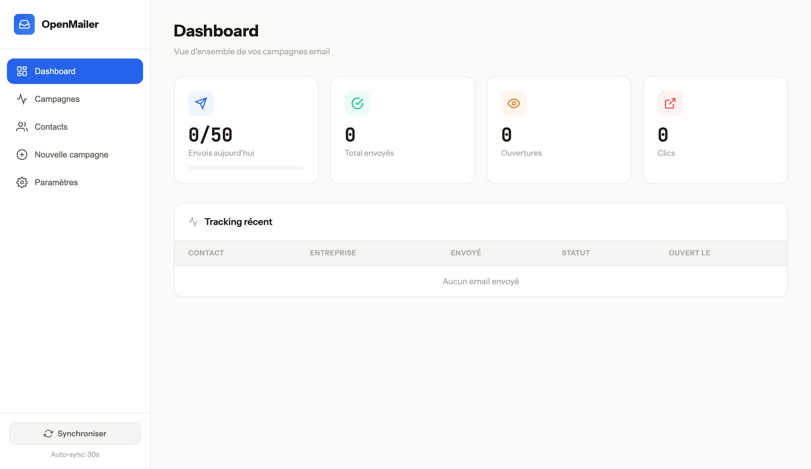
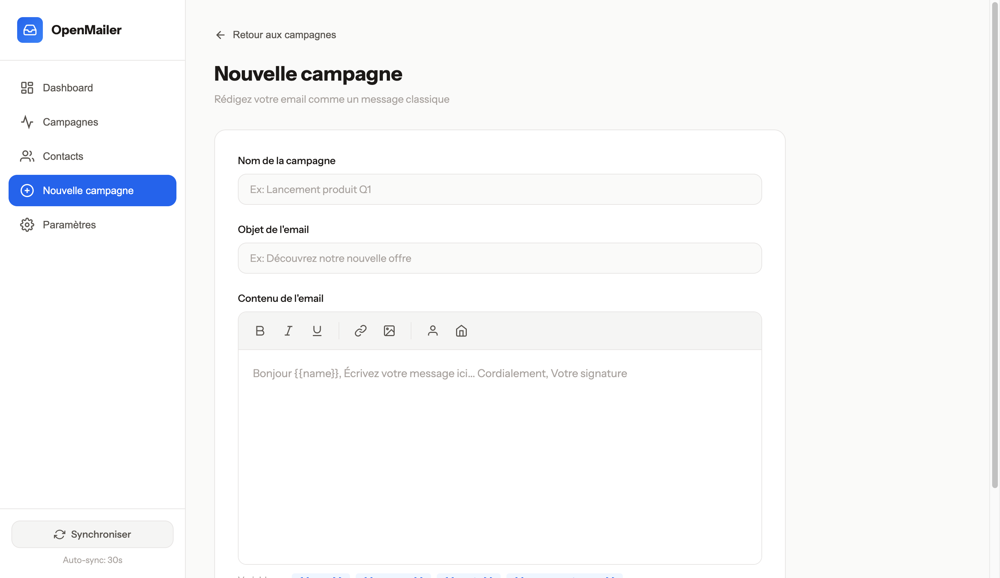
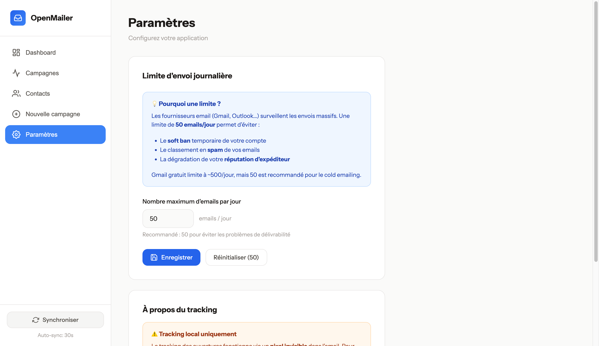
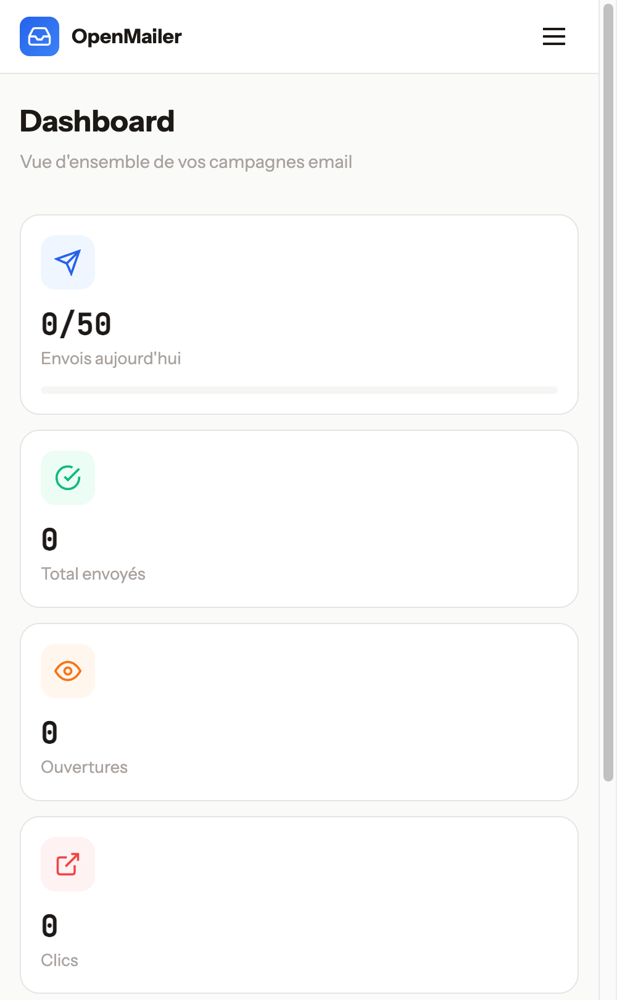

<div align="center">

# 📧 OpenMailer

**Self-hosted email campaign manager with open tracking**

[](https://opensource.org/licenses/MIT)
[](https://nodejs.org/)
[](http://makeapullrequest.com)
[](https://flowsync0.com)

[Features](#-features) • [Installation](#-installation) • [Usage](#-usage) • [Configuration](#️-configuration) • [API](#-api) • [Contributing](#-contributing)

---

**OpenMailer** is a lightweight, self-hosted email campaign tool for small businesses and developers. Send personalized emails, track opens/clicks, and manage unsubscribes — all from a clean, modern interface.



<details>
<summary>📸 More Screenshots</summary>

### Campaign Editor


### Settings


### Mobile View


</details>

🚫 No monthly fees • 🔒 Your data stays yours • ⚡ Simple setup

</div>

---

## ✨ Features

| Feature | Description |
|---------|-------------|
| 📤 **Campaign Management** | Create and send email campaigns with daily limits |
| 📊 **Open Tracking** | Know who opened your emails via invisible pixel |
| 🔗 **Click Tracking** | Track link clicks in your campaigns |
| 📋 **CSV Import** | Bulk import contacts from CSV files |
| 🔄 **Smart Resend** | Automatically resend to contacts who didn't open |
| 🚫 **GDPR Compliant** | Built-in unsubscribe links and List-Unsubscribe headers |
| ✅ **Email Verification** | MX + SMTP validation before sending |
| 🎨 **Modern UI** | Clean, responsive interface with WYSIWYG editor |
| 🗄️ **Zero Config DB** | SQLite built-in (Node.js 20+ native) |

## 🚀 Installation

### Prerequisites

- **Node.js 20+** (uses native SQLite)
- **SMTP account** (Gmail, SendGrid, Mailgun, OVH, etc.)

### Quick Start

```bash
# Clone the repository
git clone https://github.com/FlowSync0/OpenMailer.git
cd OpenMailer

# Install dependencies
npm install

# Configure environment
cp .env.example .env
# Edit .env with your SMTP credentials

# Start the server
npm start
```

Open `http://localhost:3001` in your browser 🎉

## ⚙️ Configuration

Create a `.env` file (copy from `.env.example`):

```env
# SMTP Settings
SMTP_HOST=smtp.gmail.com
SMTP_PORT=587
SMTP_USER=your-email@gmail.com
SMTP_PASSWORD=your-app-password

# Application
PORT=3001
BASE_URL=http://localhost:3001
DAILY_LIMIT=50

# Sender Info
SENDER_NAME=Your Name
SENDER_EMAIL=your-email@gmail.com
```

<details>
<summary><strong>📧 Gmail Setup Guide</strong></summary>

1. Enable **2-Step Verification** on your Google account
2. Go to [Google Account Security](https://myaccount.google.com/security)
3. Navigate to "App passwords"
4. Create a new app password for "Mail"
5. Copy the 16-character password to `SMTP_PASSWORD`

</details>

<details>
<summary><strong>📬 Other SMTP Providers</strong></summary>

| Provider | Host | Port |
|----------|------|------|
| Gmail | smtp.gmail.com | 587 |
| Outlook | smtp.office365.com | 587 |
| SendGrid | smtp.sendgrid.net | 587 |
| Mailgun | smtp.mailgun.org | 587 |
| OVH | ssl0.ovh.net | 587 |

</details>

## 📖 Usage

### 1. Import Contacts

Prepare a CSV file with at least an `email` column:

```csv
email,name,company
john@example.com,John Doe,Acme Inc
jane@example.com,Jane Smith,Startup Co
```

Auto-detected columns: `email`, `name`, `company` (case-insensitive, multiple variants supported)

### 2. Create a Campaign

Use the built-in WYSIWYG editor to compose your email. Available template variables:

| Variable | Description |
|----------|-------------|
| `{{name}}` | Contact's name |
| `{{company}}` | Contact's company |
| `{{email}}` | Contact's email |
| `{{unsubscribeUrl}}` | Unsubscribe link (GDPR required) |

### 3. Send & Track

1. Click **"Test"** to send yourself a preview
2. Click **"Send"** to launch the campaign
3. Monitor opens and clicks in real-time on the dashboard

## 🔢 Why 50 emails/day default?

The default limit protects you from:

- 🚫 **Soft bans** from email providers
- 📭 **Spam folder** placement
- 📉 **Sender reputation** damage

Gmail allows ~500/day, but 50 is recommended for cold outreach. Adjust in Settings or via `DAILY_LIMIT` env var.

## 📊 Tracking

### How it works

- **Opens**: Invisible 1x1 pixel loaded when email is viewed
- **Clicks**: Links wrapped through tracking endpoint
- **Unsubscribes**: Automatic via `{{unsubscribeUrl}}`

### ⚠️ Local Limitations

**Tracking requires a public URL!**

In localhost, recipients can't reach your server to load the tracking pixel. For full tracking:

1. Deploy to a server with public IP/domain
2. Set `BASE_URL` to your public URL
3. Tracking pixels will then be accessible

## 🛠️ API

| Endpoint | Method | Description |
|----------|--------|-------------|
| `/api/stats` | GET | Global statistics |
| `/api/campaigns` | GET | List campaigns |
| `/api/campaigns` | POST | Create campaign |
| `/api/campaigns/:id/send` | POST | Send campaign |
| `/api/campaigns/:id/test` | POST | Send test email |
| `/api/contacts` | GET | List contacts |
| `/api/contacts/import` | POST | Import CSV |
| `/api/settings` | GET/POST | App settings |
| `/track/open/:id` | GET | Tracking pixel |
| `/unsubscribe/:id` | GET | Unsubscribe handler |

## 📁 Project Structure

```
openmailer/
├── server.js           # Express server
├── services/
│   ├── database.js     # SQLite management
│   ├── mailer.js       # Email sending + verification
│   └── csvParser.js    # CSV import
├── public/
│   └── index.html      # Frontend UI
├── data/
│   └── mailing.db      # Database (auto-created)
├── uploads/            # Temporary CSV files
├── .env.example        # Config template
└── package.json
```

## 🔒 GDPR Compliance

Built-in features:
- ✅ Unsubscribe link in every email
- ✅ `List-Unsubscribe` header
- ✅ Local data storage (no third-party cloud)
- ✅ Contact deletion capability

**Your responsibility**: Ensure you have consent before sending.

## 🤝 Contributing

Contributions are welcome! Feel free to:

- 🐛 Report bugs
- 💡 Suggest features
- 🔧 Submit pull requests

## 📄 License

[MIT](LICENSE) - Use freely, modify, distribute.

---

<div align="center">

Made with ❤️ by [FlowSync0](https://flowsync0.com)

⭐ **Star this repo if you find it useful!** ⭐

</div>
